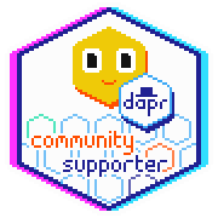

# Dapr in Action: Collaborative Multi-Agent Workflow

### Presentation: [Slides](./workshop/dapr_pydata_2025.pdf)

## Workshop description

Welcome to the workshop on building AI Agents with Dapr!

[Dapr](https://github.com/dapr/dapr) is a powerful open-source runtime that simplifies building distributed applications. During this session, you'll get up to speed on Dapr's fundamentals and gain practical experience creating AI agents using [dapr-agents](https://github.com/dapr/dapr-agents).

## Introductory Workshop Requirements

First clone the repo:

```bash
git clone https://github.com/Dzvezdana/pydata_workshop_september2025
cd pydata_workshop_september2025/
```

Then choose to run the workshop using a devcontainer (and VSCode) or without.

<details>
  <summary>
  <b>Devcontainer details</b>
  </summary>

The devcontainer has the following pre-installed:
- Python 3.12
- uv
- Dapr CLI (and initialized)

To use the devcontainer you require:
- [VSCode](https://code.visualstudio.com/)
- [Remote-Containers extension](https://marketplace.visualstudio.com/items?itemName=ms-vscode-remote.remote-containers)
- [Docker Desktop](https://www.docker.com/products/docker-desktop/)

Open the folder in VSCode and reopen it in a container when prompted. If you are not prompted, use the command palette (Ctrl+Shift+P) and select "Remote-Containers: Reopen in Container".
</details>

## Usage with devcontainer

Create a virtual environment and install dependencies using `uv` or `virtualenv`:

<details>
    <summary>
    <b>Create virtual environment with uv</b>
    </summary>

1. Create the environment (if it already exists, it will be reused):

    ```
    uv venv --allow-existing
    ```

2. Activate the environment:

    ```
    source .venv/bin/activate
    ```

3. Install dependencies:

    ```
    uv sync --active
    ```

</details>

<details>
  <summary>
  <b>Create virtual environment with virtualenv</b>
  </summary>
  Create and activate the virtual environment:

1. Create the virtual environment:

    ```
    python3 -m venv .venv
    ```

2. Activate the virtual environment (command might differ per OS):
    ```
    source .venv/bin/activate
    ```

3. Install dependencies:

    ```
    pip install -r requirements.txt
    ```

</details>

## Usage without devcontainer

Make sure you have Python 3.10+ installed.

Create a virtual environment and install dependencies using `uv` or `virtualenv`:

<details>
    <summary>
    <b>Create virtual environment with uv</b>
    </summary>

1. Create the environment (if it already exists, it will be reused):

    ```
    uv venv --allow-existing
    ```

2. Activate the environment:

    ```
    source .venv/bin/activate
    ```

3. Install dependencies:

    ```
    uv sync --active
    ```

</details>

<details>
  <summary>
  <b>Create virtual environment with virtualenv</b>
  </summary>
  Create and activate the virtual environment:

1. Create the virtual environment:

    ```
    python3 -m venv .venv
    ```

2. Activate the virtual environment (command might differ per OS):
    ```
    source .venv/bin/activate
    ```

3. Install dependencies:

    ```
    pip install -r requirements.txt
    ```

</details>

### Dapr

Install Dapr CLI and Docker Desktop:

* [Dapr CLI](https://docs.dapr.io/getting-started/install-dapr-cli/)
* [Docker Desktop](https://docs.docker.com/desktop/)

Check if Dapr was installed correctly:

```
dapr -h
```

Then, initialize Dapr:

```
dapr init
```

## API Keys

API keys can be accessed via this [privatebin](https://privatebin.net/?e6d4e8e7efc6d902#5EvJn3xXQ7m2ZX1YoMHgGhT9BoUL3AjYUs8ubjMMsQ6h). The password will be shared during the workshop.

The keys will only be available during the workshop. If you want to follow the workshop after, please generate read-only HuggingFace API key yourself first at https://huggingface.co/.

If you need a quick recap on agents and tools, navigate to `workshop/intro-to-agents/` and create a `.env` file in the `workshop/intro-to-agents/` directory with your API key:

```env
cd workshop/intro-to-agents/
export HUGGINGFACE_API_KEY=your_api_key_here >> .env
```

## Start workshop

Open `[optional] assignment_01.md` and start the workshop.

After you are done with this assignment, navigate to `workshop/multi-agent-workflow/` and create a `.env` file in the `workshop/multi-agent-workflow/` directory with your API key:

```env
cd workshop/multi-agent-workflow/
export HUGGINGFACE_API_KEY=your_api_key_here >> .env
```

Open `assignment_01.md` and start the workshop.

## Credits

This workshop was set up by Dana Arsovska ([Git](https://github.com/Dzvezdana), [LinkedIn](https://www.linkedin.com/in/dana-arsovska/)) and Marc Duiker ([LinkedIn](https://www.linkedin.com/in/mduiker/), [web site](https://marcduiker.dev/)).

All code samples shown in this workshop are available in the [Dapr Agents repository](https://github.com/dapr/dapr-agents/tree/main) in the quickstarts folder. Give this repo a star and clone it locally to use it as reference material for building your next Dapr Agents project.

You can also check out the free [Dapr Agents Course at Dapr University](https://www.diagrid.io/dapr-university).

If you are doing this workshop at home and have any questions, join [Dapr's Community Discord channel](https://dapr.io/community/).

Thank you for joining and participating in our workshop! ✨🎉

_You can now [claim this digital badge](https://bit.ly/dapr-supporter) to show that you're a Dapr supporter! (requires GitHub login)_



